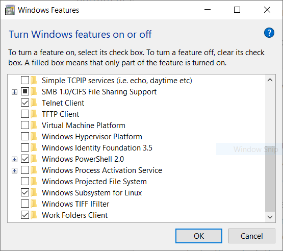

# Windows Subsystem for Linux (WSL) 


### Install WSL

Before installing any Linux distros for WSL, you must ensure that the "Windows Subsystem for Linux" optional feature is enabled:


* Open PowerShell as Administrator and run: 

   ```powershell
   Enable-WindowsOptionalFeature -Online -FeatureName Microsoft-Windows-	Subsystem-Linux
   ```

* Restart your computer when prompted

   ### or
   

* open your Settings menu.

* In the search bar, type “turn windows features on or off,” click the item from the drop-down box, and a new window will pop up.

   

* It may take a few moments to load, but once it’s done there will be a list of features with checkboxes next to them. Scroll down to **Windows Subsystem for Linux** and check the box. This will begin downloading and installing the necessary files. Your computer will then restart, after which the installation is complete.

   

### Install your Linux Distribution of Choice

**Download and install from the Microsoft Store**

1. Go to this link.

   - [Ubuntu 18.04 LTS](https://www.microsoft.com/store/apps/9N9TNGVNDL3Q)

2.  From the distro's page, select "Get" 

### Setting up your WSL to run ASM code

   **Run the following commands in your terminal**
* Go to **Start** search **cmd**
* run `bash` command
* run the following commands one by one
```bash
sudo apt update
sudo apt upgrade
sudo apt install binutils
sudo apt install gdb
```

